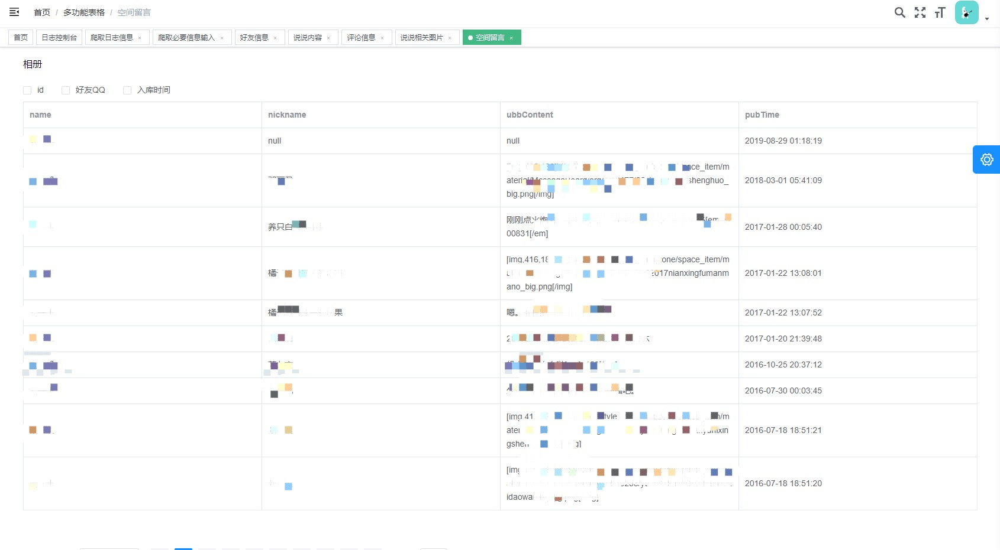

## 1.首页显示好友数量，留言条数，日志信息，共爬取文章数量

## 2.日志控制台，爬取日志实时显示

## 3.爬取信息输入，qq号，qq密码，可自由选择爬取内容：说说、评论、留言、相册

## 4.好友详细信息显示，表格可扩展，可自由选择显示字段

## 5.显示好友的说说详情，发布日期、好友姓名、说说内容、好友qq号等详细信息,并且可以通过好友姓名、qq搜索

## 6.爬取好友说说评论信息，好友的好友的评论内容，评论人的QQ号等信息

## 7.发布说说附带的图片，部分图片可能下载失败，将图片下载到本地并显示。

## 8.好友qq空间留言板信息，留言人的姓名、留言内容、留言时间等

## 8.好友相册内容、相册包含图片数量

## 9.好友相册图片

## 10.爬取日志信息记录
